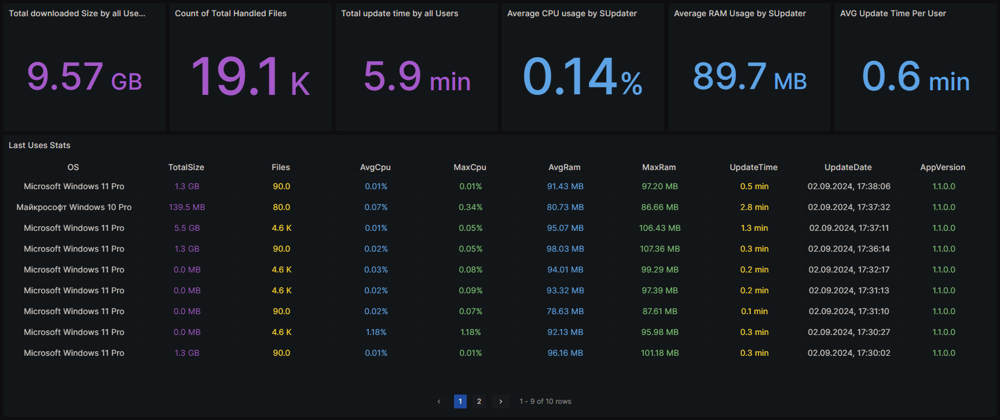

# SUpdater

SUpdater - утилита, позволяющая синхронизировать данные с удаленной директорией на FTP.

## Зачем?

Возникла необходимость обновлять данные на ПК разных пользователей, чтобы не перекидываться архивами и файлами через мессенджеры и файлообменники.

Да, безусловно, есть утилиты по типу *RSync*, но они сложны в использовании и являются совершенно не User-Friendly. Было решено сделать Self-Contained Single-File утилиту, которая позволит быстро и легко решить вопрос синхронизацией.

## Что умеет

### Универсальное обновление файлов на основе конфигурации.

**SUpdater** является универсальным и не зависит от того, что ему нужно обновлять.

Достаточно лишь положить его в нужную папку, поменять параметры конфигурации и запустить. Всё дальнейшее обновление данных выполняется лишь запуском .exe файла в Windows, либо Binary файла в Linux.
Поддерживается как стандартный режим, который задает вопросы пользователю и поддерживает конфигурацию на основе вводимых данных пользователя. Также, есть тихий режим, который не задает вопросов и просто обновляет данные.

**SUpdater** умеет игнорировать скачивание данных на основе Regex правил, чтобы не качать мусор.

### Самообновление

**Supdater** поддерживает механизм самообновления. Если пользователь разрешил проверку наличия обновлений, то приложение проверит наличие новой версии и обновит само себя. При этому пользователю не нужно ничего делать и перезапускать, после обновления приложение запустится в том же окне хоста.

На данный момент обновление идет по хэшу, тег версии самого приложения имеет вспомогательное значение для [ClickHouse](#clickhouse).

## Где доступно

Windows 8.1+ x64, Linux x64.

## CI / CD
При выпуске новой версии автоматически собираются и выкладываются исполняемые файлы. Работает в связке Gitea + Drone CI.

Актуальные версии всегда доступны в самообновлениях, либо по ссылкам:

[Windows x64](https://releases.gamefarming.ru/SUpdater/win-x64/SUpdater.zip)

[Linux x64](https://releases.gamefarming.ru/SUpdater/linux-x64/SUpdater.zip)

## ClickHouse
Если пользователь разрешает нам сбор анонимной статистики, то после выполнения пользовательского задания в наш ClickHouse отправляются данные (например: средняя и максимальная нагрузки на процессор и память в процессе обновления, количество скаченных файлов и общий размер загрузки, затраченное время, версия приложения и пр.).

Это позволяет нам строить графики в Grafana, а также анализировать потенциальные проблемы.

## Демонстрация работы

